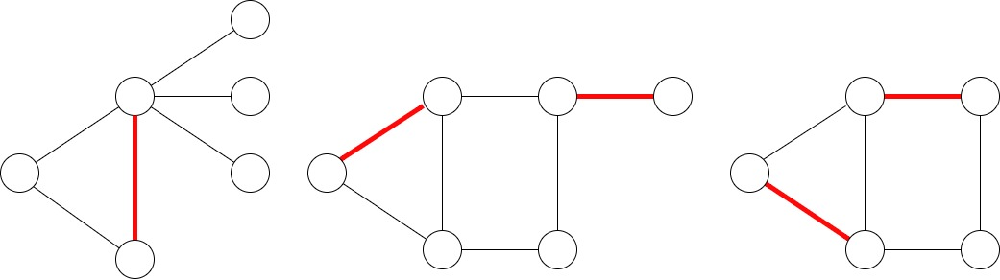
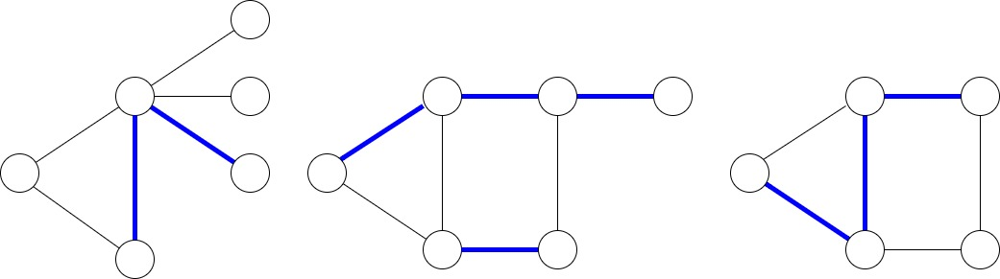
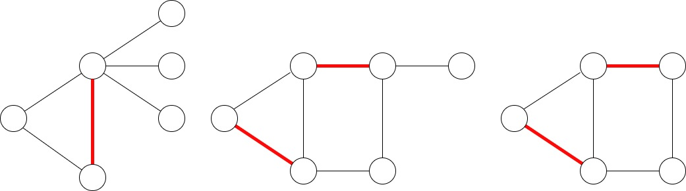
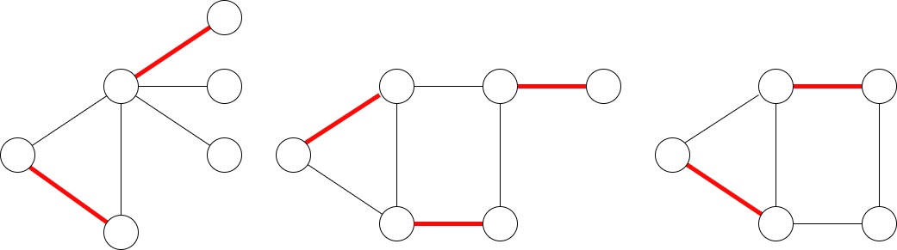
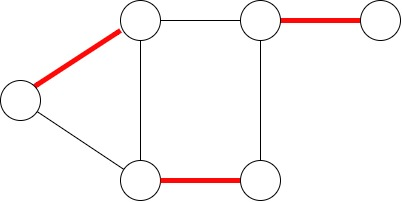
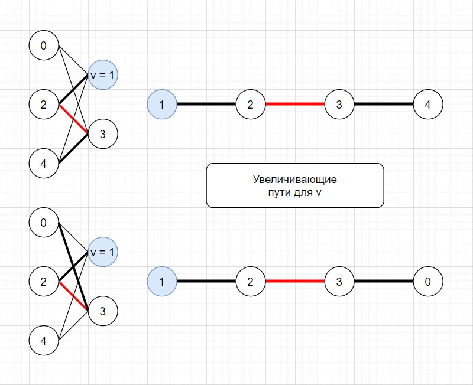
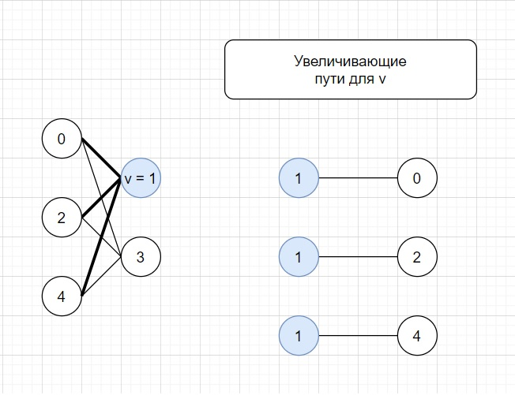
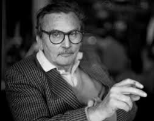

## Паросочетание ( Matching )

1. Определяем объект для работы

    **Паросочетение** - множество ребер `E`, у которых **НЕТ ОБЩИХ ВЕРШИН**

    Также паросочтение можно определить, как множество попарно несмежных ребер, где под смежностью ребер  
    понимается наличие общей вершины (вершины инцедентной обоим ребрам)

    Наглядные примеры паросочетаний:

    
    
    Наглядные примеры **НЕ** паросочетаний:

    

    Далее к паросочетанию предъявлется еще ряд условий и мы получаем

    **Максимальное паросочетние** - паросочетание, не являющеся подмножеством никакого другого паросочетания.

    Наглядные примеры максимальных паросочетаний:

    

    **Наибольшее паросочетание** - паросочетание, для которого не найдется паросочетания 
    с большим числом ребер.

    Наглядные примеры наибольших паросочетаний:

    

    **Совершенное паросочтение** - паросочетание, для которого каждая вершина графа инцидентна   
    некоторому ребру из паросочтения

    Наглядный пример совершенного паросочетания:

    

    **Чередующийся путь** `P` для паросочетания `M` - это путь `P`, в котором идет чередование  
    ребер паросочетания `M`

    

    **Дополняющий путь** `P` для паросочетания `M` - это путь :
    * является чередующимся путем
    * "концы пути не инциденты ребрам паросочетания"="концы пути не покрыты паросочетанием"

        

### Утверждение 1.1

Может быть >= 2 увелчивающих путей с общим началом 

### Утверждение 1.2

Для `M` : `|M| = 0` и проверяемой `v` увеличивающим путем является путь из **одного** ребра

### Утверждение 1.3

Всякий простой путь `path=v`0`e`0...`e`n-2`v`n-1 в двудольном графе G с долями `A` и `B`   имеет структуру:
    1. `v`i с четными номерами в `A`
    2. `v`i с нечетными номерами в `B`

Замечание: выше для определенности `v`0 in `A`

### Доказательство:
1. От противного. Найдется i : `v`i in `A`, `v`i+1 in `A`

2. Из п.1 в доли `A` между `v`i и `v`i+1 есть ребро => противоречие

### Утверждение 1.4

В двудольном графе G с долями `A` и `B` максимальная длина простого пути равна `2 * min(|A|, |B|)`

### Доказательство:
1. Берем кортеж `P` размера `n = |A| + |B|` - это простой путь который собираемся строить
2. Для определенности `|A|` = `min(|A|, |B|)`
3. В `P` как максимум может присутствовать `|A|` вершин из доли `A`. Иначе путь не будет простым
4. Для определенности:
    * `P` начинается с `v` in `A`
    * нумерация с 0
5. С учетом структуры простого пути двудольного графа оставшиеся вершины `A` стоят на четных номерах
6. Нечетные позиции заполняются `|A|` вершинами из доли `B`

Итог: максимальная длина простого пути `P` равна `2 * min(|A|, |B|)`
Илюстрации к пунктам на примере K3,2

### Утверждение 1.5

В двудольном графе G с долями `A` и `B` число простых путей с  `min(|A|, |B|)` веришнами из `argmin(A, B)` с  
началом в `v` in `argmin(A, B)` равно 
    `C``min(|A|, |B|)` `max(|A|, |B|`)  *  `min(|A|, |B|)!` *  `min(|A|, |B|)!`

### Доказательство

1. Для определенности:
    * `P` простой путий
    * `P` начинается с `v` in `A`
    * нумерация с 0
    * `|A|` = `min(|A|, |B|)`
2. Из п.7 максимальная длина `P` 2`|A|`
3. Есть `|A|`! перестановок вершин доли `A`
4. Есть `|A|`! перестановок вершин `B`' subset `B`: |`B`'| = `|A|`#
5. `B`' произвольные `B` вершин из `B`

Итог: Из п.3 - 5 по правилу умножения число различны `P` равно C `|B|` по `|A|` * `|A|`! * `|A|`!

### Утверждение 1.6
 
В двудольном графе G с долями `A` и `B` нельзя вывести все простые пути, начинающиеся в `v` in `A` c
Complexity: O`(V + E)`

### Доказательство:
1. Из п.8 вывод всех простых путей `P`:
    * `|P|` = `|A|` 
    * `P` начинается с `v` in `A` 
    
    требует C `|B|` по `|A|` * `|A|`! * `|A|`! операций, что явно больше `const * (|V| + |E|)` операций

# Лемма Бержа

## Автор: Клод Берж (1926 - 2002)

## Дата: 1957
   
## Формулировка
        
`M` максимально <=> нет увеличивающего пути `P`

## Интуиция 

Рассмотрение **увеличивающих путей** дает "итеративный" подход по добавлению ребер в  
текущее паросочетание. Позволяет "строить максимальное паросочетание".

## Доказательство =>:

Покажем, что имея увеличивающий путь `P`, паросочетание `M` можно увеличить на 1 ребро

Из опр. увеличивающего пути:
1. Для `e`0 in `P` верно  `e`0 not in `M`
2. Для `e`1 in `P` верно `e`1 in `M`
3. Для `e`0 in `P` верно  `e`0 not in `M`
4. Для `e`1 in `P` верно `e`1 in `M`

Делаем преобразование `M`:
1. `E`even = { `e`i | `e`i in `P` и i  чет} добавляем в паросочетание =  
"добавляем в паросочетания ребра пути ранее в паросочетании НЕ лежавшие" 
2. `E`odd = { `e`i | `e`i in `P` и i  нечет} удаляем из паросочетания =  
"удаляем из паросочетания ребра пути ранее в паросочетании лежавшие" 
3. |`E`even| = |`E`odd| + 1

Итог: `|M|` увеличилось на + 1

`M` останется паросочетанием:
1. проверим "дяя любой `v` in `V` не найдется `e`1, `e`2 in M: `v` in `e`1, `v` in `e`2"
2. для каждой `v` in `P` было удалено смежное ребро и добавлено смежное ребро => 

## Доказательство <=:

Нет увеличивающего  `P` => `M`  максимально

Будем доказывать контрапозицию. 

`M` **не** максимально => есть увеличивающий `P`

`M`prime - максимальное паросочетание.

Рассмотрим `Q = (V, M Δ M`prime`)`

### Утверждение 2.1
 
 Ребра в `Q` — не паросочетание.

### Доказательство

Любая `v` in `V` имеет максимум два смежных ребра — одно ребро из `M` второе ребро из `M`^prime 
Ведь если бы у нее было зотя бы 3 смежных ребра, то по принципу Дирихле эти 2 ребр попали бы (для определенности) 
в `M`. Однако, такого быть не может поскольку ребра из `M` по определению не имеют общих вершин.

### Утверждение 2.3
 
`Q` состоит из циклов и путей

### Доказательство:

### Утверждение 2.4

 Все пути в `Q` имеют четную длину

### Доказательство:

1. Возьмем произвольный путь `P` в `Q`.
2. В `P` ребра чередуются: ребро из `M` -> ребро из `M`prime -> ребро из `M`
3. Возьмем путь нечетной длины Path_ODD => в G это увеличивающий путь `M` или для `M`prime
4. п.3 протеворечив
    * для `M` противоречие с условием
    * для `M`prime противоречие с максимальностью

### Утверждение 2.5

 Все циклы в `Q` имеют четную длину

### Доказательство

1. Возьмем произволльный цикл Cycle
2. В Cycle ребра чередуются: ребро из `M`, ребро из `M`prime, ребро из `M`
3. п.2 не выполняется в цикле нечётной длины

    Если бы нашлись ei in `M` ei + 1 in `M`, то нарушено чередование
    Если бы нашлись ei in `M` ei + 1 in `M`, то нарушено чередование

4. Из п.3 все циклы `Q` с четной длиной.

### Утверждение 2.6

 `Q` содержит равное количество рёбер из `M` и из `M`prime

### Утверждение

В `Q` все рёбра `M` и `M`prime, за исключением ребер из пересечения

### Утверждение 2.7

 `|M|` = `|M|`prime

### Доказательство:

Следствие утв.5

### Итог

Утв.6 показывает, что `M` - максимальное паросочетание => противоречие (полагали, что `M` не максимальное)
        

# Алгоритм Куна

## Автор: Гарольд Вильям Кун ( 1925 - 2014 год )

## Сложность: `O(V(V + E))`

## Назначение: 

Поиск максимального паросочетания в двудольном графе

## Алгоритм словами

1. Берём пустое `M`
2. Пока есть увеличивающий путь `P` выполняем чередование паросочетания вдоль этого пути
3. Увеличивающего пути нет => найдено максималное паросочетание

Поиск увеличивающего пути:
1. Берем вершину графа
2. Запускает DFS
3. В DFS проверяем существование увеличивающего пути из `v`
    * "Перебрать все `to` in graph[`v`]" - "перебрать концы ребер, исходящих из `v`"
    * Сценарии для выбранной `to`:
        * `to` **НЕ** насыщена => есть увеличивающей путь - это путь есть ребро (`v`,`to`) => 
        => добавляем (`v`,`to`) в паросочетание => прекращаем поиск увеличивающей цепи из вершины `v`
        * `to` насыщена ребром (`to`, `p`) => проходим по (`to`, `p`) => DFS делает переход в `p` => поиск дополняющео 
         пути производится для `p`

Дальнейшие рассуждения проводятся для одной доли графа `Partitie`1

1. Берем вершину `v` in `Partitie`1
2. Вершина `v`:
    * "насыщена" => `v` не рассматривается
    * не "насыщена" => производится насыщение `v`, т.е. производится поиск увеличивающего пути с началом в `v`

Оценка: `V` запусков обхода в глубину => `O(V(E + V))`

### Улучшение

в качестве первой доли выбрать долю с наименьшим числом вершин.  

### Причина 

DFS запускается на каждой вершине `Partitie`1.  
Соответсвенно оценка `O(|Partitie|`1`(V + E))`.  
Чем `|Partitie|`1 меньше, тем оценка лучше => `Partitie`1 должна быть  
наименьшей по числу вершин долью.

### Реализация

Сущность `matching` ~ matching - массив для набора паросочетания

Вход:
`Partitie`1, `Partitie`2, `E` - доли и ребра `G = (V, E)` - двудольный граф

Основан на: DFS

`n:= |Partitie|`1 
`k:= |Partitie|`2 
`g[v]` - список вершин y: `(v, y)` in `E`

Нумерация вершин:
1. `|Partitie|`1: `1 ... n`
2. `|Partitie|`2: `1 ... k`

`matching` - паросочетание для второй доли
`matching[i]`:
1. номер `v` in `Partitie`1: exists `e` : `e`=(`v`,i) и i in `Partitie`2
2. -1 если п.1 не выполнен 

used - цвета вершин 0, 1

`Kunh` = DFS 
Возвращает:
1.   true  <=> найдена увеличивающая цепь из `v`   

Замечаение: к моменту возврата функция произвела чередование паросочетания вдоль найденной цепи

1. Для **`v`** из первой доли:
    * просматриваются все `e`: `v` инцидентна `e`
    * проверяется ведет ли `e` в ненасыщенную вершину `to`
    * либо если `to` насыщена и  найдена увеличивающая цепь рекурсивным запуском из `matching[to]` => 
    => найдена увеличивающая цепь => возвращаем true 
     и  перенаправляем ребро, смежное с `to`, в вершину `v`.
    
2. Текуще паросочетание - "пустое множество математически" ~ "пустой массив переходя к вопросу реализации" ~ 
3. `matching` заполняется числами -1
4. Выбирается `v` из первой доли `Partitie`1
5. Сбарасывается в False used 
6. Из `v` запускается DFS - `Kunh`

## Вопросы для самопроверки
1. Какие действия с путем нужно произвести, чтобы пополнить паросочетание?
2. Перебирает ли алгоритм Куна **ВСЕ** пути с началом в `v`?
3. Может ли быть >= 2 увеличивающих путей с общим началом?
4. Какова число ребер в увеличивающем пути при условии `|M = 0|`?
5. Алгоритм выделяет какой-то увеличивающий путь или всегда наибольший по числу вершин?