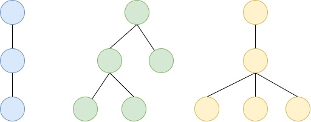
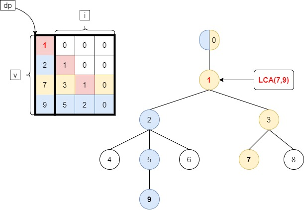
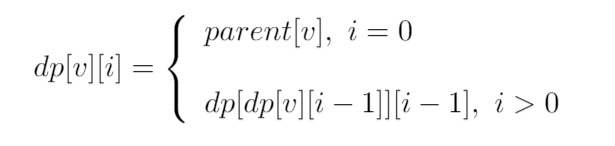
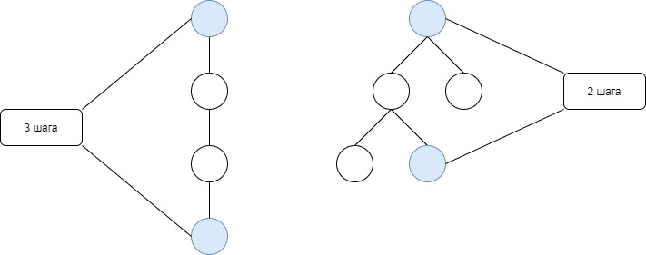
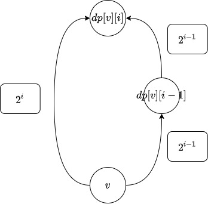
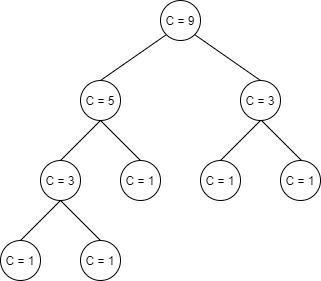
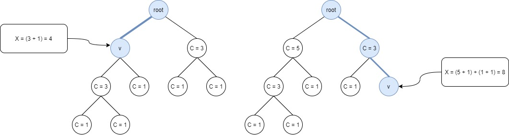
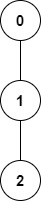

# LCA ( Least Common Ancesstor )

В задаче рассматривается корневое дерево

**Корневое дерево** - дерево, у которого выделена одна вершина и для каждой вершины задана высота </br>
(длина кратчайшего простого пути от корня)

Потомки могут иметь **более** 2-ух дочерних вершин

**Наглядные примеры деревьев высоты 3 с 1, 2, 3 потомками:**



Этот факт влияет на реализацию: способ хранения дерева

# Метод двоичного подъема

Относится к разделу динамического программирования

## Вспомогательные структуры:
    
`dp` - двумерный массив вершин

`dp[v][i]` - "вершина, в которую приходим из v за 2<sup>i</sup> шагов"

Пример для дерева из 10 вершин



## Вычисление dp



## Утверждения:
1. `dp[v][i]` = "вершина, в которую приходим за 2<sup>`i`</sup> шагов"
2. Из любой вершины за `n` шагов вверх можно прийти в корень

    Замечание: говорим `n` а не log<sub>2</sub>n т.к. на хвод могут дать дерево, являющееся обычной цепью. </br>
    Высоты листа в подвешенной цепи будет `n`.

    

3. Из п.1, 2 при log<sub>2</sub>n `dp[v][i]` - корень

Доказательство:

1. "число шагов из `v`" = "число шагов до корня"
2. 2<sup>`i`</sup> = `n`
3. `i` = log<sub>2</sub>n
4. Из п.3 в `dp[v][i]` требуется nlog<sub>2</sub>n ячеек (для каждой вершины log<sub>2</sub>n, при `i` >= log<sub>2</sub>n `dp[v][i] = "корень"`)

Итог: Space: O(nlog<sub>2</sub>n), Complexity: O(nlog<sub>2</sub>n)

## Псевдокод
```
function preprocess():
     int[] p = dfs(0)
     for i = 1 to n
        dp[i][0] = p[i]
     for j = 1 to log(n)
        for i = 1 to n
           dp[i][j] = dp[dp[i][j - 1]][j - 1]
  
  int lca(int v, int u):
     if d[v] > d[u]
        swap(v, u)
     for i = log(n) downto 0
        if d[dp[u][i]] - d[v] >= 0
           u = dp[u][i]
     if v == u
        return v
     for i = log(n) downto 0
        if dp[v][i] != dp[u][i]
           v = dp[v][i]
           u = dp[u][i]
     return p[v]
```
## Пояснения
1. Равенство `dp[v][i] = dp[dp[v][i-1]][i-1]` означает:</br>
"вершина, в которую приходим за 2<sup>`i`</sup> шагов из `v`" = "подняться из `v` за 2<sup>`i - 1`</sup> шаг и сделать еще 2</sup>`i - 1`<sup> шагов"



2. Неравенство `dp[x][k] != dp[y][k]` рассматривается для максимального k, поскольку оно указывает на 1-ую не общую для x и y вершину на пути к корню

3. `LCA(x, y)` не обязан лежать в строках `x` и `y`.</br>
В примере для `x = 9, y = 7` ситуация `dp[x][k] != dp[y][k]` выполняется при макисмальном `k = 1`.</br>
Однако, `LCA(x, y) = 1`, но в строке `y = 7` `LCA(x, y) = 1` нет.

# Представление дерева

## Способ 1

Узел дерева представляется кортежем `(data, parent, next, first)`, где

`data` - данные в узле
`parent` - родительский узел
`next` - следующий узел
`first` - первый узел

```c++
template<class DataType>
struct CNode {
    DataType data;
    CNode* parent;
    CNode* next;
    CNode* first;
};
```

### Проблемы

Необходимость выделения большого числа памяти. Значительное число вызовов оператора `new`.

## Способ 2

Дерево представляется массивом из узлов с кортежем `(data, parent)`

`data` - данные в узле
`parent` - родительский узел

```c++
template<class DataType>
struct CNode {
    DataType data;
    CNode* parent;
};
```

Замечание: в контесте дерево представлено таким способом

> Вторая строка содержит n-1 целых чисел, i-е из этих чисел равно номеру родителя вершины i.

### Проблемы

1. Решение задачи LCA опирается на DFS (1 обход)
2. В данном способе для узла отсутствует список смежных вершин => нельзя выполнить DFS

### Метод двоичного подъема

В общей реализации поиск в глубину дает информацию:
1. Родитель `p[v]` для `v` в дереве
2. Высота `v` в дереве

п.1 известен из условия задачи D
п.2 получаем рекурсивным запуском вверх от каждой ячейки массива 

Complexity: O(nlog<sub>2</sub>n)

# Декартово дерево по неявному ключу

Декартово дерево - бинарное дерево + бинарная куча

"Неявному ключу" = "Ключа физически нет, поддерживается логически"

## Выражаем ключ X

Ключ `X` будет выражен как "число вершин в левом поддереве + 1 (рассматриваемая вершина)" в 2 шага

Шаг 1: Вводится вспомогательная величина `C`

`C`="число вершин в поддере + 1 (рассматриваемая вершина)`



Шаг 2: Для рассматриваемой `v` значение `X` есть сумма величин `C` в левых поддеревьях на</br>
пути из `root` в `v` + 1 на каждой посещенной вершине



# Задача D

## Примеры

Ввод:

```
3 2
0 1
2 1
1 1 0
```

Вывод:

```
2
```

Пояснение:

`n = 3`, `m = 2`, `x = 1`, `y = 1`, `z = 0`

Дерево:



Числа: 
   * a<sub>1</sub> = 2
   * a<sub>2</sub> = 1
   * a<sub>3</sub> = 2

      a<sub>3</sub> = (1 * a<sub>1</sub> + 1 * a<sub>2</sub> + 0) % 3 = (a<sub>1</sub> + a<sub>2</sub>) % 3 = (1 + 2) % 3 = 0</br>
   * a<sub>4</sub> = 2

      a<sub>4</sub> = (1 * a<sub>2</sub> + 1 * a<sub>3</sub> + 0) % 3 = (a<sub>2</sub> + a<sub>3</sub>) % 3 = (1 + 0) % 3 = 1 

Запросы:
   * (a<sub>1</sub>, a<sub>2</sub>) = (2, 1)

      v = LCA(2, 1)  = 1
   * ((a<sub>3</sub> + v) % 3, a<sub>4</sub>) = ((0 + 1) % 3, 1) = (1, 1)
      
      Берем i = 2 на втором запросе т.к. фраза "первый запрос" относилась к i = 1

      v = LCA(1, 1) = 1

Ответ: sum = 1 + 1 = 2

1. Строим массив глубин вершин

2. По массиву глубин вершин строим декартово дерево по неявному ключу:
    * приоритет глубина
    
# Источники

1. [Декартово дерево](https://neerc.ifmo.ru/wiki/index.php?title=%D0%94%D0%B5%D0%BA%D0%B0%D1%80%D1%82%D0%BE%D0%B2%D0%BE_%D0%B4%D0%B5%D1%80%D0%B5%D0%B2%D0%BE)
2. [Декартово дерево по неявному ключу](https://neerc.ifmo.ru/wiki/index.php?title=%D0%94%D0%B5%D0%BA%D0%B0%D1%80%D1%82%D0%BE%D0%B2%D0%BE_%D0%B4%D0%B5%D1%80%D0%B5%D0%B2%D0%BE_%D0%BF%D0%BE_%D0%BD%D0%B5%D1%8F%D0%B2%D0%BD%D0%BE%D0%BC%D1%83_%D0%BA%D0%BB%D1%8E%D1%87%D1%83)
3. [Метод двоичного подъёма](http://neerc.ifmo.ru/wiki/index.php?title=%D0%9C%D0%B5%D1%82%D0%BE%D0%B4_%D0%B4%D0%B2%D0%BE%D0%B8%D1%87%D0%BD%D0%BE%D0%B3%D0%BE_%D0%BF%D0%BE%D0%B4%D1%8A%D1%91%D0%BC%D0%B0)
4. [RMQ к задаче LCA](https://neerc.ifmo.ru/wiki/index.php?title=%D0%a<sub>1</sub>%D0%B2%D0%B5%D0%B4%D0%B5%D0%BD%D0%B8%D0%B5_%D0%B7%D0%B0%D0%B4%D0%B0%D1%87%D0%B8_RMQ_%D0%BA_%D0%B7%D0%B0%D0%B4%D0%B0%D1%87%D0%B5_LCA)