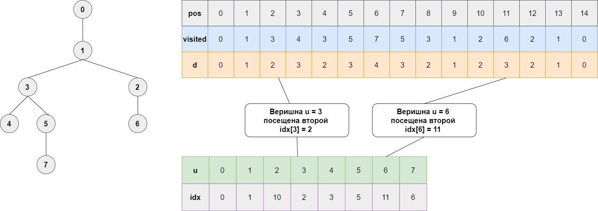
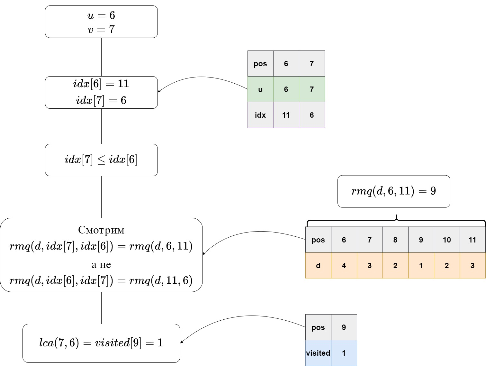
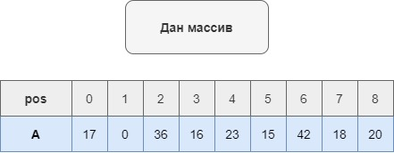
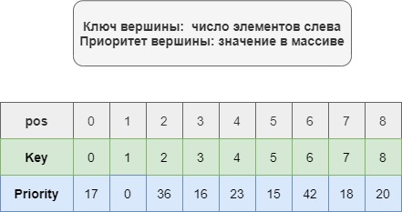
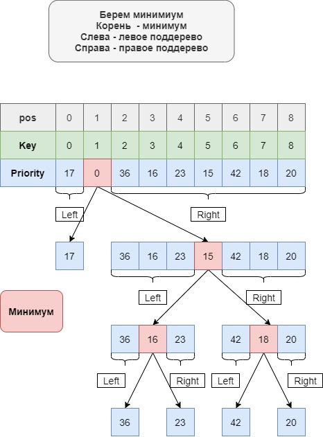
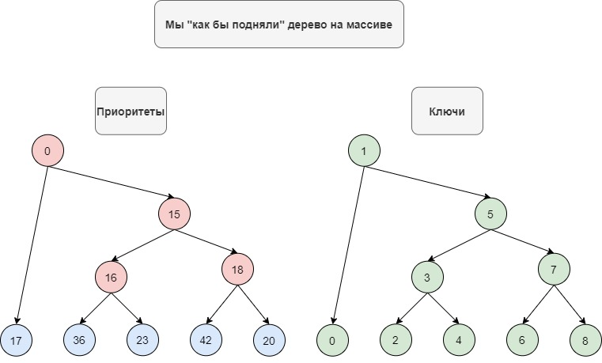
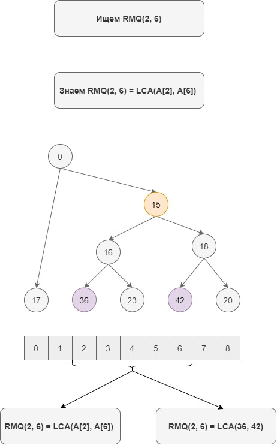

# Сведение LCA к RMQ

Задача LCA:

`Для корневого дерева T по каждой паре (u, v) вывести наименьшего общего предка`

Требуется задачу LCA решить в терминах задачи RMQ

Вспомогательные структуры:
1. Массив глубин вершин `d`
2. Массив посещенных вершин `visited` (строится одновременно с `d`)
3. Массив порядка посещения вершин `idx` для `d`

`idx[u]` - шаг обхода в глубину, на котором посещена `u`

Замечание: всюду далее нумерация с 0

Положим:
* `rmq(d, l, r) = индекс минимумума на d[l, r] (argmin(d[l, r]))`
* `lca(u, v) = минимальный общий предок u, v`

Используем:

`idx[u] <= idx[v]` => `lca(u, v) = visited[rmq(d, idx[u], idx[v])]`

Пояснения:

`idx[u] <= idx[v] = u посетили раньше чем v`

`visited[rmq(d, idx[u], idx[v])] = вершина с минимальной глубиной на d[l, r]`

`глубина для u расчитана раньше, чем для v` => `наименьш. общ. предок u, v вершина с мин. глубиной на d[l,r]`

# Сведение RMQ к LCA

Задача:

`Для массива A по каждой паре (i,j) найти min(A[i, j])`

Требуется задачу RMQ решить в терминах задачи LCA   

Вспомогательные структуры:
* декартово дерево по неявному ключу

Построение дерева:
* Положить корень `min(A[1, n])`. Минимальных несколько => взять произвольный. 
Для определенности первый с начала. Ниже полагаем `A[i] = min(A[1, n])`
* Построить левое поддерево на `A[1, i - 1]`
* Построить правое поддерево на `A[i + 1, n]`

Приоритет: значение в массиве  
Ключ: порядковый номер вершины в массиве `A` 
Представление неявного ключа: в каждой вершине храним константу `C = кол-во вершин в левом поддереве`

Используем:

`rmq(i, j) = lca(A[i], A[j])`

Пояснения:
`rmq(i, j) - минимум на A[i, j]`

`lca(A[i], A[j]) - при построении в корнях поддеревьев клали минимумы,` 
`соответственно наименьший общий предок это минимум `

Пример:

# Источники

[LCA2RMQ](https://neerc.ifmo.ru/wiki/index.php?title=%D0%A1%D0%B2%D0%B5%D0%B4%D0%B5%D0%BD%D0%B8%D0%B5_%D0%B7%D0%B0%D0%B4%D0%B0%D1%87%D0%B8_LCA_%D0%BA_%D0%B7%D0%B0%D0%B4%D0%B0%D1%87%D0%B5_RMQ)

[RMQ2LCA](https://neerc.ifmo.ru/wiki/index.php?title=%D0%A1%D0%B2%D0%B5%D0%B4%D0%B5%D0%BD%D0%B8%D0%B5_%D0%B7%D0%B0%D0%B4%D0%B0%D1%87%D0%B8_RMQ_%D0%BA_%D0%B7%D0%B0%D0%B4%D0%B0%D1%87%D0%B5_LCA)